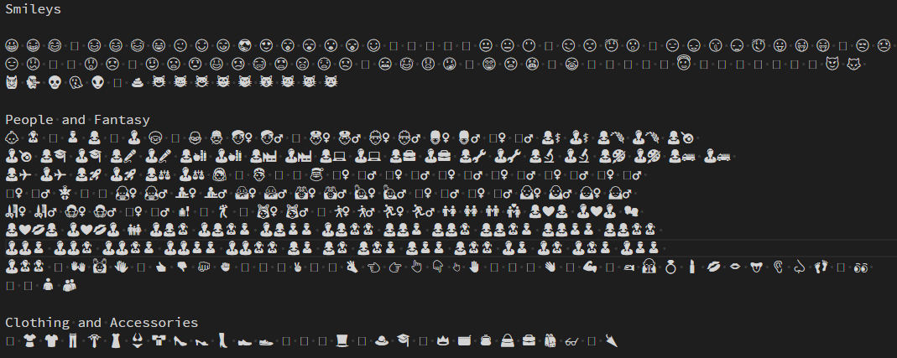
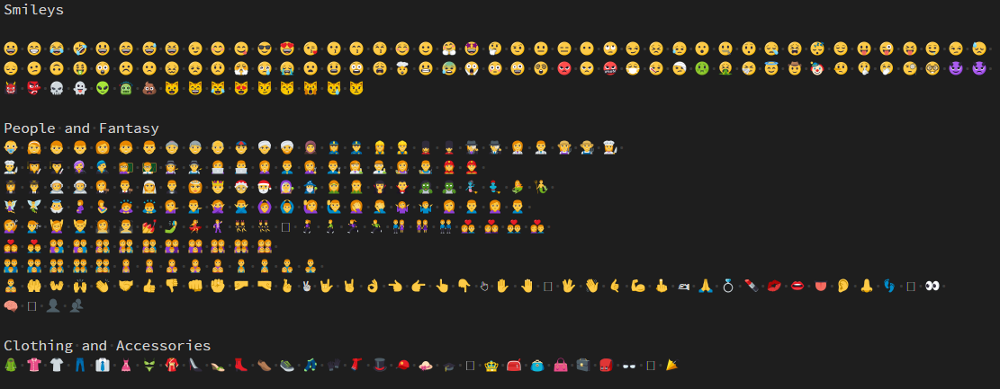

# VS Code Emoji
Add color emoji support to VS Code on Windows 7 (and lower).

## Demo
### Without the extension (before)

### With the extension (after)

## Why
Emojis are unicode characters that are generally included in a font on your operating system. However, on Windows 7 and lower, they are only "supported", meaning that you need to have the appropriate font installed (Segoe UI Emoji), and it will not render colored emojis, but system icons, which are black and white.

In order to enjoy emojis in VS Code, this extension was written. It does two things:
* It replaces unicode representations of emojis into their image equivalent
* It replaces :short_code: emojis into their image equivalent

# References
* https://www.microsoft.com/en-us/design/emoji
* https://en.wikipedia.org/wiki/Segoe

## License
The code is licensed under the [MIT license](http://choosealicense.com/licenses/mit/). See [LICENSE](LICENSE).
